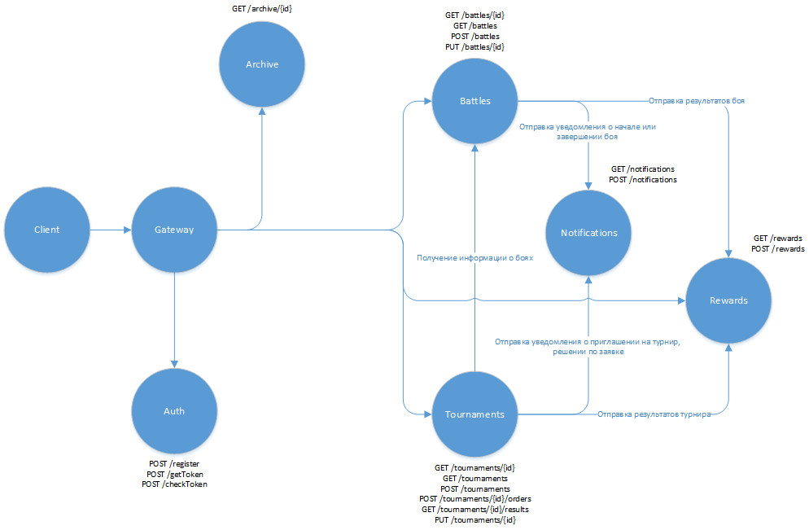

### Микросервисы:
* gateway (шлюз) - входная точка для клиентского приложения; выполняет роутинг на остальные микросервисы в зависимости от 
полученного запроса (например, по шаблону пути); проверяет наличие токена авторизации в запросе клиента.
* auth (авторизация) - отвечает за регистрацию, выдачу токена пользователям. Возможные Endpoints:
  * POST /register - регистрация
  * POST /getToken - получение токена
  * POST /checkToken - проверка токена  
С авторизацией взаимодействуют все микросервисы (для проверки токена), а также клиент через шлюз (для регистрации и получения токена).
* tournaments (турниры) - отвечает за организацию боёв - как турниров, так и боёв между пользователями по договорённости. Возможные Endpoints:
  * GET /tournaments/{id} - просмотр турнира
  * GET /tournaments - просмотр списка турниров (с возможными фильтрами по датам)
  * POST /tournaments - организация турнира (или боя по договорённости - в зависимости от переданных параметров)
  * POST /tournaments/{id}/orders - подача заявки на участие в турнире
  * GET /tournaments/{id}/results - просмотр результатов турнира
  * PUT /tournaments/{id} - редактирование турнира  
Взаимодействует с сервисом battles - для получения информации о боях, входящих в турнир. Направляет в сервис notifications 
приглашения на турнир, решения по заявке на участие в турнире. Направляет в сервис rewards результаты турнира.
* battles (бои) - игровой сервер, в который пользователи направляют команды для конкретного боя; позволяет получить информацию 
о конкретных боях. Возможные Endpoints:
  * GET /battles/{id} - просмотр конкретного боя
  * GET /battles - просмотр списка боёв (с возможными фильтрами)
  * POST /battles - создание боя
  * PUT /battles/{id} - отправка команд  
Взаимодействует с сервисом notifications - направляет информацию о начале и завершении боя, а также с сервисом rewards - направляет результаты.
* rewards (вознаграждения) - отвечает за начисление рейтинговых очков участников и турниров. Возможные Endpoints:
  * GET /rewards - просмотр рейтинговых баллов пользователя или турнира (в зависимости от переданных параметров)
  * POST /rewards - сохранение статистики для дальнейших расчётов вознаграждений и баллов. В т.ч., может получать данные из очереди.  
Получает из сервисов tournaments и battles результаты турниров и боёв.
* archive (архив) - позволяет просмотреть прошедшие бои.
  * GET /archive/{id} - просмотр прошедшего боя.  
Обращается к той же БД, что и сервис battles (возможно, к cold-ноде или реплике).
* notifications (уведомления) - отвечает за обработку уведомлений пользователям. Возможные Endpoints:
  * GET /notifications - просмотр списка уведомлений пользователю
  * POST /notifications - создание уведомления. В т.ч., может получать данные об уведомлениях из очереди.  
Получает информацию об уведомлениях из сервисов tournaments и battles. Направляет уведомления пользователю - возможно, с 
использованием email, мессенджеров, firebase.

### Узкие места:
* gateway - через него идёт всё общение клиента со всей системой. Следует увеличить количество экземпляров для повышения надёжности.
* auth - без токенов невозможен доступ к функционалу. Для повышения надёжности следует увеличить количество экземпляров, возможно,
добавить кэширование пользователей (чтобы существующие пользователи могли продолжать пользоваться функционалом), продумать 
наиболее оптимальный срок жизни токена (чтобы пользователям не приходилось слишком часто получать новый).
* battles - в некоторые периоды времени (например, выходные, вечер) может быть повышение нагрузки из-за большого количества 
желающих. Есть несколько возможных вариантов решения - ввести ограничения на количество одновременных боёв, настроить тарифные планы 
для бесплатных и платных боёв, развернуть сервисы в kubernetes, чтобы происходило автомасштабирование при увеличении количества пользователей.
* archive - одновременно может загружаться слишком много информации из архива. Для этого следует предусмотреть отдельную ноду БД для архива. 
Следует обращаться к readonly реплике (там могут быть не самые актуальные данные). Старые данные хранить на cold нодах. Обращение к архиву 
не должно мешать записи и получению текущих данных.

### Компоненты, к которым чаще всего будут меняться требования:
Чаще всего будут меняться требования к tournaments (правила, организация проведения и регистрации на турниры) и battles
(правила проведения боёв). Для выполнения принципа открытости-замкнутости следует продумать архитектуру так, чтобы 
не менять уже созданный код. Для этого использовать интерфейсы, чтобы была возможность впоследствии подменять реализации. 
Для зависимостей следует использовать IoC-контейнер. Необходимые алгоритмы настраивать с помощью стратегий.  
Будут появляться новые настройки, объекты и способы взаимодействия между ними. Для этого будут создаваться новые команды
(без изменения существующего кода) и стратегии. 

### Схема:
